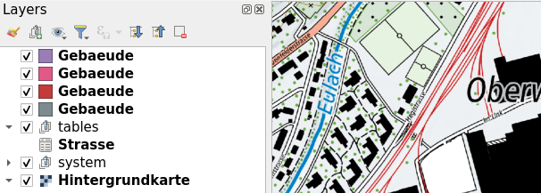
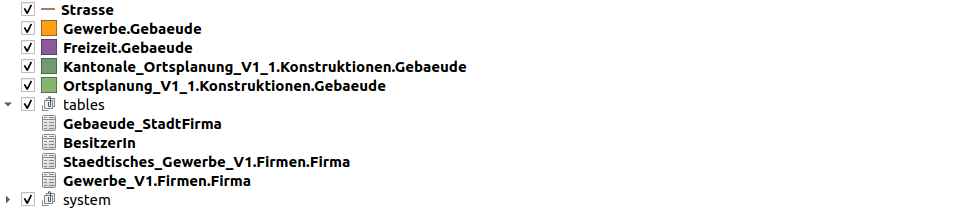
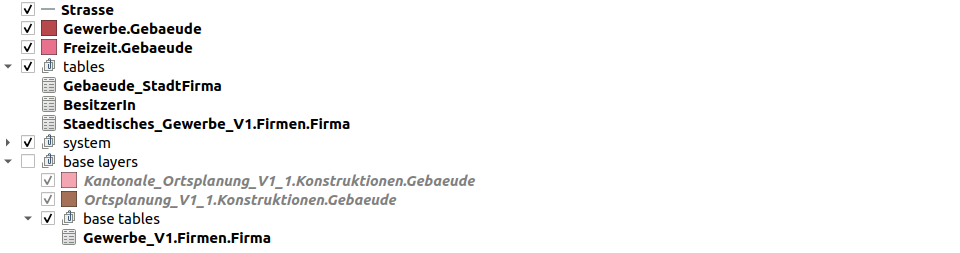
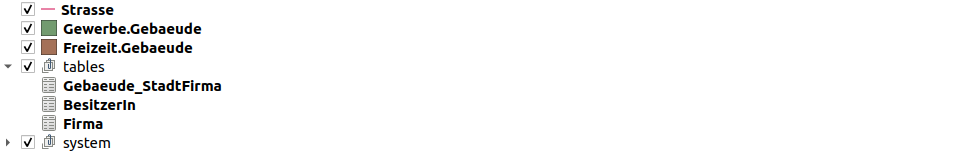

# Verbessertes Arbeiten mit erweiterten INTERLIS Modellen in Model Baker

---

## Problem

Wenn ein Modell bzw. Topic **erweiterte Klassen** enthält, werden die **inklusive Basisklassen** in der physischen Datenbank implementiert...
 
... und folglich Layer in QGIS erstellt. 

Da die erweiterten Klassen oftmals die **gleichen Namen** haben, ist es schwierig sich zurecht zu finden.

---

Dabei möchte Benutzer:in nur das sehen, was relevant ist 🙄

... und das schreckt auch Newbies ab 😱

---

## QGIS.ch hat finanziert

Doch ist nicht so einfach:

**Model Baker kann nicht immer wissen, was für Benutzer:in sehen möchte.**

<aside class="notes">
Da es fast unmöglich erscheint, alle Fälle zu berücksichtigen, muss ich einige Annahmen treffen, was meistens der Fall sein wird.</aside>

---

## Annahmen

- Wenn du eine Basisklasse mit **demselben** Namen erweiterst, willst du sie "ersetzen", sonst würdest du sie umbenennen.
- Wenn du eine Basisklasse **mehrfach** erweiterst (was man mit unterschiedlichen Namen tut), dann willst du sie ebenfalls "ersetzen".
- Ausnahme der beiden Fällen: Wenn du die Klasse im gleichen Modell, aber in einem anderen Thema erweiterst (denn wenn du die Absicht hättest, sie zu "ersetzen", hättest du sie zu `ABSTRACT` gemacht).

---

## Ansatz 
- Basisklassen mit ***gleichnamigen*** Erweiterungen sind ***irrelevant***
- Basisklassen mit ***mehreren*** Erweiterungen sind ***irrelevant***
- Ausser wenn die Erweiterung im ***gleichen Modell*** ist, sind sie nicht ***nicht irrelevant***

---

## Strategie 1: Verstecken
- Basisklassen-Layer mit gleichnamigen Erweiterungen werden ***ausgeblendet*** und Basisklassen-Layer mit mehreren Erweiterungen ***ebenfalls***. Es sei denn, die Erweiterung befindet sich im selben Modell, dann wird sie ***nicht ausgeblendet***, sondern ***umbenannt***.
- Beziehungen von ausgeblendeten Ebenen werden ***nicht erstellt*** und damit auch ***keine Widgets***.

---

## Strategie 2: Gruppieren
- Basisklassen-Layer mit gleichnamigen Erweiterungen werden ***in einer Gruppe zusammengefasst***, Basisklassen-Layer mit mehreren Erweiterungen ***ebenfalls***. Ausser wenn die Erweiterung im gleichen Modell ist, dann wird sie ***nicht gruppiert***, sondern ***umbenannt***.
- Beziehungen der gruppierten Ebenen werden ***erstellt***, aber die Widgets werden ***nicht auf das Formular angewendet***.

---

## Keine Strategie: Umbenennung

**Wird neu sowieso gemacht**:
Sofern ein Layer mit gleichem Namen besteht, wird das Topic vorangesetzt.

---

---

---

---

## Schauen wirs uns an

- Staedtische_Ortsplanung_V1 Modell
- Model Baker Prototype

---

## Questions?
 

#### Web: www.opengis.ch
#### Emails: info@opengis.ch 
#### Social: @opengisch
